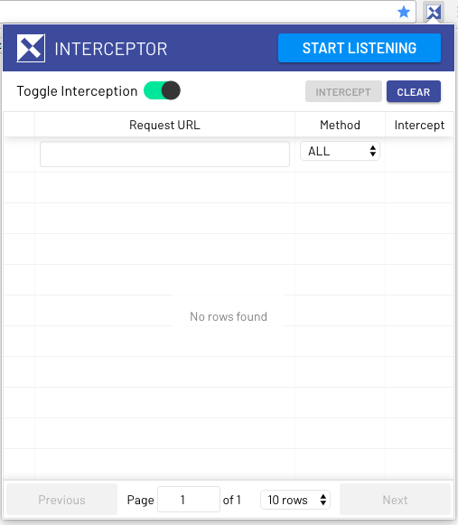
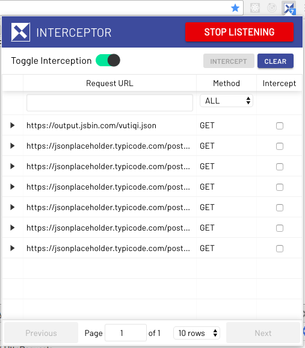
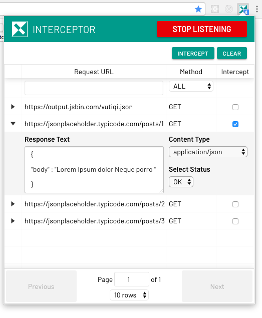
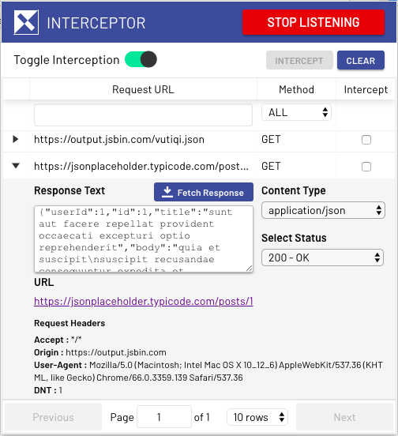
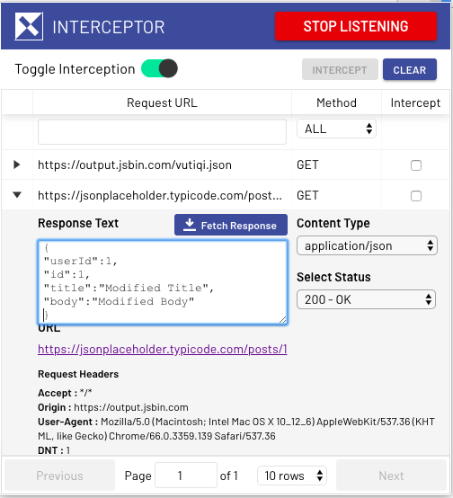
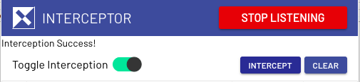
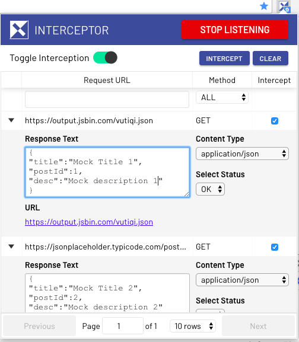
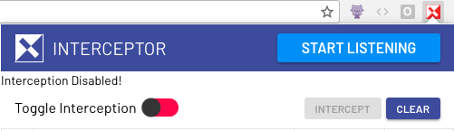

# Interceptor 

[](https://travis-ci.org/code-mancers/interceptor)
[](https://github.com/code-mancers/interceptor/blob/master/LICENSE)
[](http://commitizen.github.io/cz-cli/)


A browser extension that mocks AJAX request at the browser level so you
can run front ends without really starting a backend server.

Firefox : [](https://addons.mozilla.org/en-US/firefox/addon/xhr-interceptor/)

Chrome : [](https://chrome.google.com/webstore/detail/interceptor/enenfaicdcfgcnjmiigcjbmlbaoapnen)

## Development

In Chrome

```
$ yarn install
$ yarn run watch
# Install "./dist" directory as "unpacked chrome extension" (google it!)
```

In Firefox

```
$ yarn install
$ yarn run watch
$ yarn global add web-ext 
$ web-ext run -s dist -f "/usr/bin/firefox"
```

## Release

```
$ yarn run build
$ AMO_API_KEY=<amo api key> AMO_API_SECRET=<amo api secret> NEW_VERSION=0.3.2 yarn run release
```


## How to use

### Listening to requests made by the browser

Once you open the extension popup, it shows a UI as seen below. By default, `Intercept Mode` is `ON`.



Once you start listening, it shows the count of total AJAX requests in a small badge and list of incoming `XHR` requests
in the popup like this:



Request headers for listened requests are listed below the response form as shown in the screenshot.



#### Response data returned by backend server

Many a times, before defining you mock response text, you would want to look at the response data returned by the server when the request is made. On clicking `Fetch Response` button, the `textarea` gets filled with the response data from the real server as shown below. However, You can completely skip this step and move on to typing out mock response text.



#### Specifying mock response data

You can click the small arrow beside the URL, which shows a form in which you can specify a response to mock, when the same request is encountered next. You also need to specify the [Content-Type header][content-type] field and [status code][status-code] for the mock response through the dropdown available as shown below.



Once the above fields are filled and checkbox is checked, click the `INTERCEPT` button. If the interception is successfull, it shows a success message as below:



You can intercept/mock multiple calls by checking as many checkboxes as you want



Henceforth the same AJAX request is made by the browser, the browser is given a fake/mock response instead of the real one.

You can also stop listening for `AJAX calls` by clicking the `STOP LISTENING` button. Requests made henceforth won't be listed on UI.

The toggle switch is used to disable `INTERCEPTOR`. If the toggle is switched to `OFF` state, it displays a message saying `Interception Disabled` as below.



In the `disabled` state, the extension won't mock any previously intercepted calls. Instead all `XHR's` are routed to the server.
The extension's icon beside the url address bar turns red for that particular tab as in screenshot above.


To mock the calls again, just toggle the switch to `ON` state, check the requests that are to be mocked and click `INTERCEPT` button.

This [blogpost](https://crypt.codemancers.com/posts/2018-04-24-intro-to-interceptor/) makes things much more clear.

## TODO

* ~~A user should be able to click on the extension button and see a popup with a list of all AJAX requests.~~
* A user should be able to "watch" ajax requests using a URL pattern.
* If watched requests are in pre-flight, block everything and ask the user how to handle it.
* ~~The user may choose to let the request pass through or fill in mock response using a form.~~
* Persist settings for each URL in localStorage.
* ~~Mocked requests should hit a sinon fakeServer.~~
* ~~User should be able to disable/enable mocking for a page without clearing persisted settings for the URL.~~

## Attribution

Icons for this projects are used from [Font Awesome](https://fontawesome.com)

 * [Play Circle](https://fontawesome.com/icons/play-circle?style=solid) and [Stop Circle](https://fontawesome.com/icons/stop-circle?style=solid) icons are used from [Font Awesome](https://fontawesome.com/license)


## License

MIT

[content-type]: https://www.w3.org/Protocols/rfc1341/4_Content-Type.html
[status-code]: https://developer.mozilla.org/en-US/docs/Web/HTTP/Status
